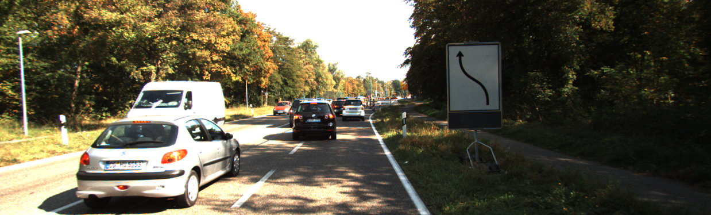
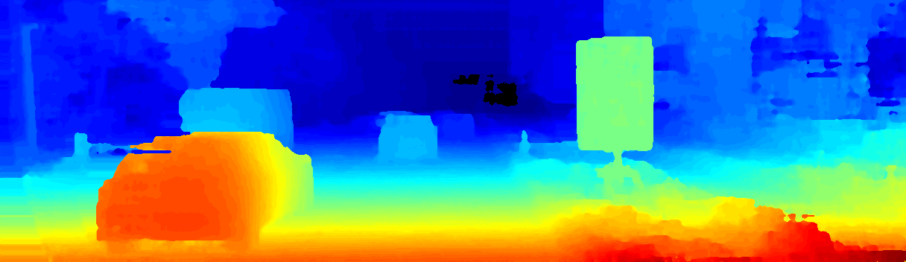
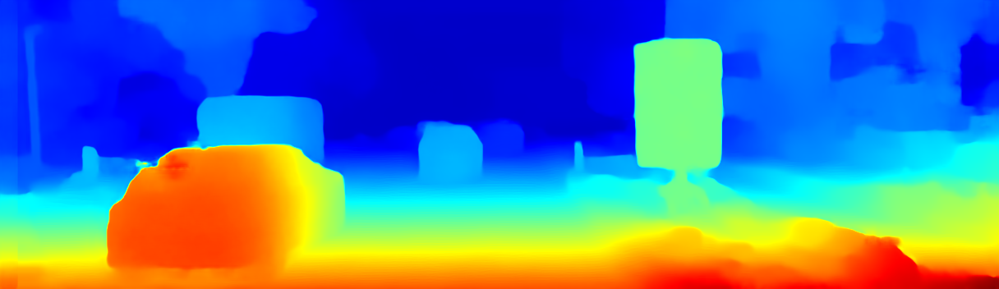
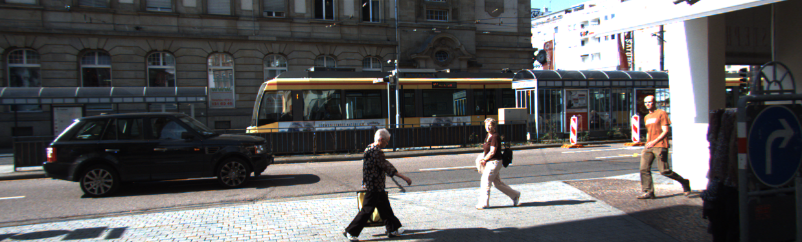
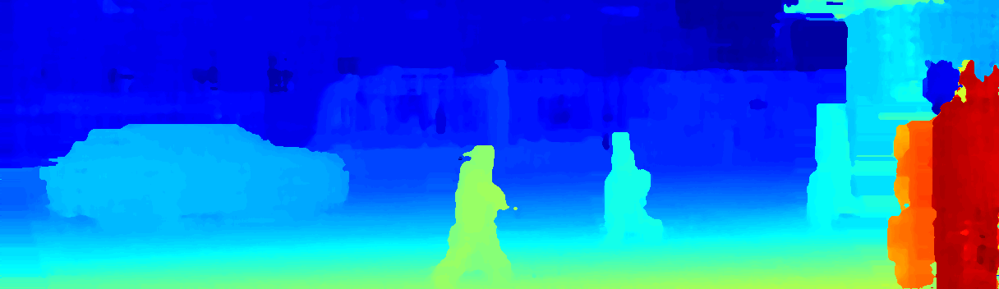
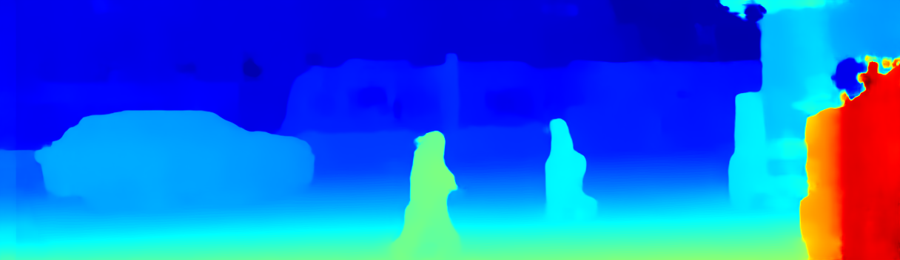

# FastFusion


This repository contains the code for "FastFusion: Deep Stereo-LiDAR Fusion for Real-time High-precision Dense Depth Sensing"


<div align="center">
    
    <p> <b>Input image</b> </p>
    
    <p> <b>Coarse disparity map</b> </p>
    
    <p> <b>Refinement disparity map</b> </p>
    
    <p> <b>Input image</b> </p>
    
    <p> <b>Coarse disparity map</b> </p>
    
<p> <b>Refinement disparity map</b> </p>
</div>

## Installation
This code is tested on:

- Ubuntu 20.04
- python 3.8
- pytorch 1.8.1
- torchvision 0.9.1
- opencv-python 4.5
- cuda 10.2


## Preparing dataset
Download the [KITTI 141 dataset ](https://drive.google.com/file/d/17zkLMWT48T-a4S9TVqx72C69SyBb67Qf/view?usp=sharing) which contains the selected 141 image pairs with corresponding different lines of LiDAR maps.  

Download the [coarse estimation](https://drive.google.com/file/d/1fKzayIBbh46r-q3UKW1eC2OvX_RdIfJU/view?usp=sharing) from StereoBit with different lines of LiDAR input.

Move two directories into the "dataset" directory which should be like this:

```
dataset
│
└───pred
└───kitti141
```

## Training
Hyperparameters can be set in utils/option.py. To train a refinement network, one should first try to pre-train the refinement network in the scene flow dataset:
 
    python train_SF.py
 
Fine-tuning the model on the KITTI 2015 dataset is also easy, you  need to specify the path of the pre-trained model and then run:

    python train_kitti2017.py


## Evaluation

To evaluate the accuracy of the refinement network on misaligned raw Lidar signal, one can run:
    
    python eva_kitti141.py

